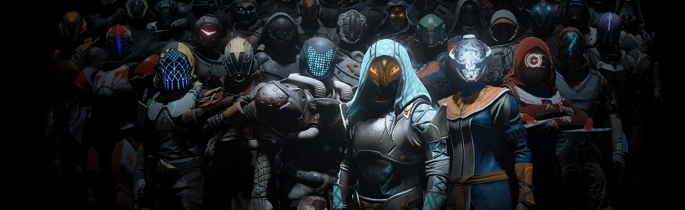

# Clan Overview

	

The Xeriscape Network partake's in Bungie's popular game Destiny 2 and offers a clan for individuals of the community to join. The clan is comprised of active players who love everything Destiny has to offer. This clan is aimed at not only new players, who are just starting their guardian's story, but also veterans who have years of experience or unique skills that they can bring into our community.

Building upon your strengths and weaknesses is a key focus as well as forming a strong bond with your fellow clan mates as you embark on memorable adventures.

We like to poke fun at each other, and even sometimes get adult in our conversations, however we always encourage a positive and welcoming environment for anyone new into our family.

For individuals who are interested in joining our clan, we advise them to read over our [community guidelines](https://xeriscape.network/guidelines/); Clan members will also be expected to meet a basic level of [requirements](membership#requirements) in order to maintain their membership within the clan.