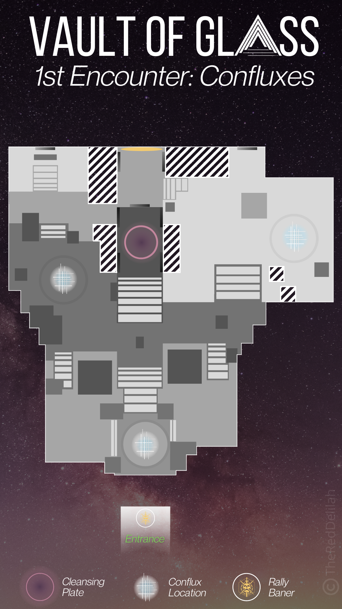
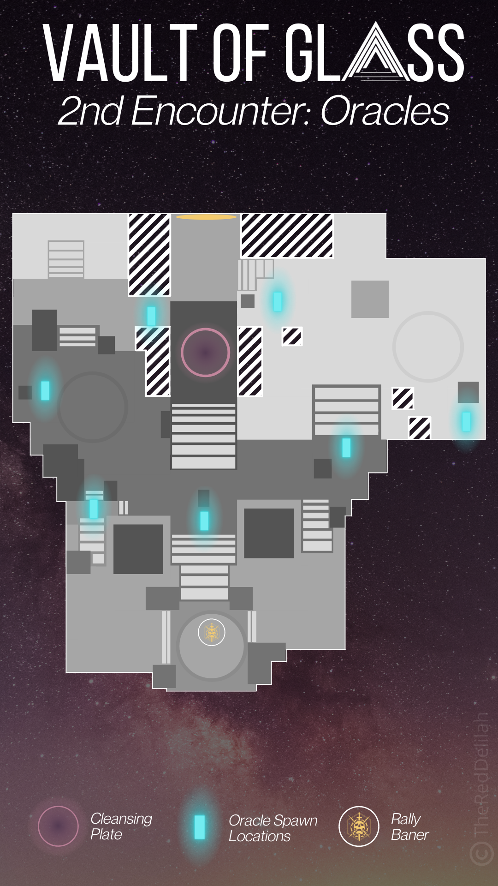
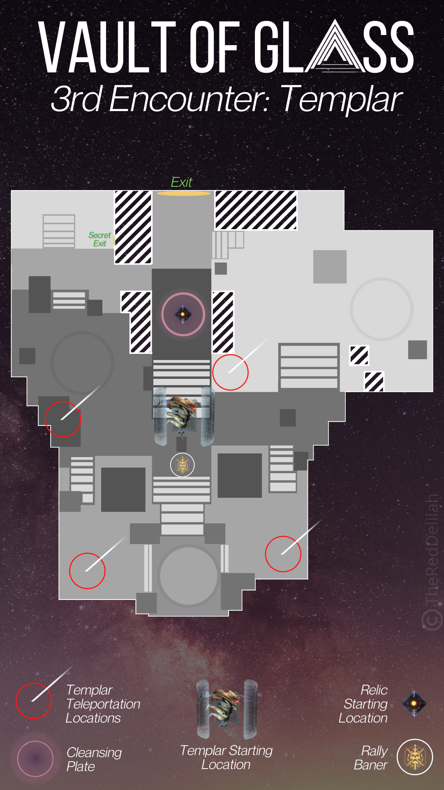
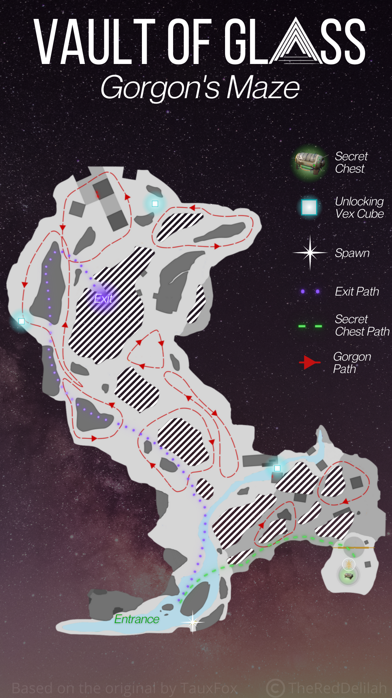
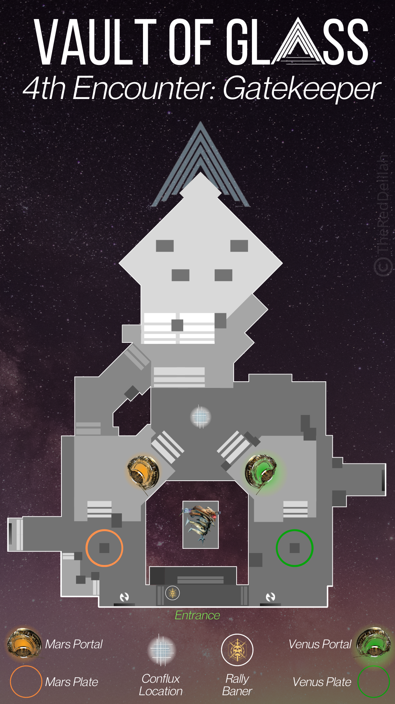
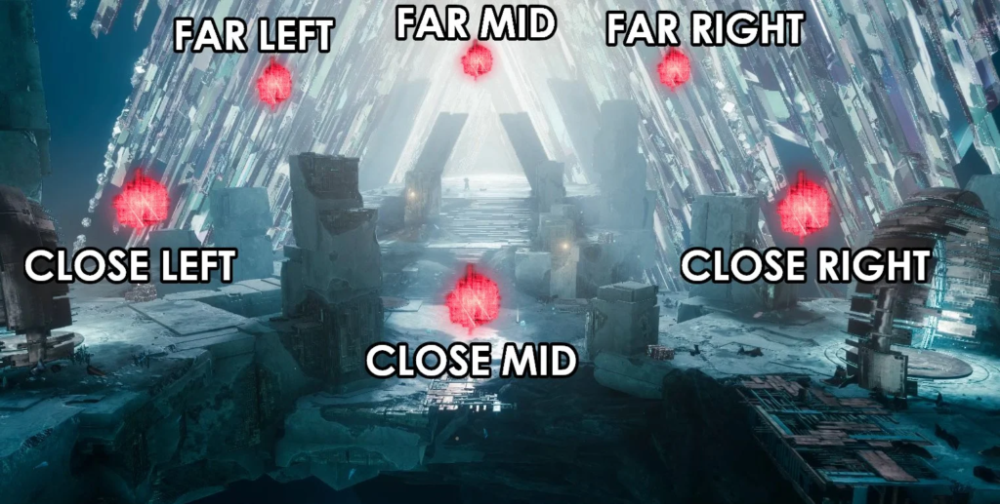
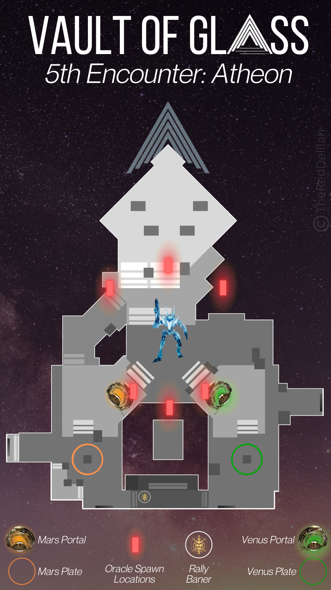

# Vault of Glass
Vault of Glass (VoG) is a reprised raid from Destiny that was launched in Destiny 2 on May 22nd, 2021. The raid takes place on Venus and can be launched from the Legends node of the Director. It should be immediately nostalgic for veterans who have played Destiny while also offering some great new twists. For newcomers, it’s a great look at how far Destiny has come in terms of raid design and complexity.

This guide is a collection of information about the various encounters that take place across the raid as well as any collectibles and secrets that are present in the raid.

## Encounters
This section of the guide is a text overview of the encounters present in the raid. For those who would like to opt for a video guide instead, it is recommended to use either raid guide video created by [KackisHD](https://www.youtube.com/watch?v=o4Ac6s2OA3g) or [Fallout Plays](https://www.youtube.com/watch?v=ZD8cx4JcjVg).

	<iframe width="560" height="315" src="https://www.youtube.com/embed/o4Ac6s2OA3g" title="YouTube video player" frameborder="0" allow="accelerometer; autoplay; clipboard-write; encrypted-media; gyroscope; picture-in-picture" allowfullscreen></iframe>

### Opening the Vault
The first encounter of Vault of Glass is to open the door into the vault. This encounter relies on a system which requires three Vex sync plates to be activated and held until a central spire is formed, opening the vault door. Praetorians as well as other vex will spawn in to try and reclaim the plates.

1. Split into teams of two and send two players to each of the three vex plates located around the entrance area.
2. Stand on the plates until they are fully activated and stay on them to continue the process of building the central spire.
3. Praetorians will spawn at various locations around the entrance; Defeat them before they reach the plates otherwise they will be reclaimed by the vex.

This encounter starts overlooking the entrance to the Vault of Glass. From spawn, you can reach the top by going left and wrapping around to the higher area. There are three vex sync plates; One on the left, one in front of the door, and the final one on the right. Send two players to each plate.

Begin by standing in all of the plates to build a connection. Once this happens, Vex will begin spawning. The smaller units, like Goblins and Hobgoblins, cannot take the plates back. The only enemy that can severe the connection and turn the plate red are the Praetorians. Focus on killing these Praetorians before they reach your plate. They will alternate their spawn points.

As you fight off the advancing vex, several cyclops will spawn around the area. These must be neutralized as fast as possible as they can deal extreme amounts of damage; Use supers and heavy to knock them down fast.

It’s not required that you stay on the plate once the connection has been made. In fact, it can sometimes make it more difficult. Just focus on stopping the Praetorians.

You can track your progress by looking to the center of the opening area where the spire will be forming inside a vex latticework. The more physical it becomes, the closer you are to opening the Vault of Glass. When it’s fully built, the enemies will despawn and a light will blast out of the spire opening the door.

### Confluxes
After working your way deeper into the Vault of Glass, you will enter the Templar’s Well where the next three encounters will take place. The first of these is the Confluxes encounter. This requires players defend three Confluxes as Vex march towards them to try and sacrifice.

### Oracles
The Oracles encounter of the Vault of Glass requires players destroy vex oracles that appear around the Templar's Well. The oracles must be destroyed in the order they appeared. Each set of oracles also has a period of time that they must be destroyed in before they cause a team wipe; This can be seen by the oracles' behavior becoming more erratic if they are not destroyed in time. If the oracles are destroyed in the wrong order, your team will be marked and will eventually wipe.

The oracle encounter in Destiny 2’s version of Vault of Glass requires that the oracles be defeated in the order that they spawn. This means communication is key and players must recall which oracle spawned and when.

Ideally, you will have players assigned to an area where an oracle spawns. They will count the chimes as the oracles spawn and call out the number when their oracle appears. For example, if the oracle you’re watching appears on the fourth chime, you will defeat it fourth. To make this easy, each player should call out their number when the oracles first appear and call out their number again as they destroy the oracle – this way each person knows when it’s their turn.

During this encounter, Goblins and Minotaurs will spawn in the area and Hobgoblins will snipe you from the outer distant blocks. You must deal with these or avoid them as you destroy the oracles.

It’s worth noting there are seven oracles in the area, which means one player will be responsible for watching and destroying two of them.

It can help to label the oracle locations so you know where they are. You can split it left and right and label them L1 to L3 and R1 to R4, with the middle Oracle being called “mid”. Use whatever method works for your team.

### Templar

The Templar fight in the Vault of Glass introduces a new tool called the Aegis or relic. The fight requires players defeat three Oracles in the correct order, before taking down the Templar’s shield using the Relic and dealing damage. The Templar will teleport to a new location and then the steps must be repeated – unless someone blocks his teleport by standing in the ring.

1. Grab the Relic to begin the Templar fight
2. Destroy three Oracles in the correct order
3. Use the Relic’s Super to remove the Templar’s shield, break players out of Detainment
4. Deal damage to the Templar, repeat the steps as necessary

Before you begin, assign one player to use the relic. It will be their job to destroy at least one Oracle, take down the Templar’s shield, and protect the team using the relics's shield function. Use the shoot button to heavy attack (which is a slam when activated in mid-air), the melee button for a fast attack, your aiming/ADS button for the shield, and the super buttons to do the relic’s firing attack (which removes the Templar’s shield). If the Relic is dropped, it will wipe the team after 10 seconds unless someone picks it up.

The fight starts as soon as the relic is picked up. From here, the person with the relic should hang around one side to see where the oracles spawn. Two other people should also assist. After the first three oracles spawn, defeat them in the order they appeared.

When the oracles are gone, the person with the relic should use the super ability to destroy the Templar’s shield. You can get Super energy faster by defeating enemies or oracles with the relic.

As soon as the Templar’s shield has been destroyed, all players (excluding the Relic holder) should begin damaging the Templar – it’s weak point is the head of the vex hydra. A random player, with exception of the relic holder, will also be marked for detain, they will need to move away from the other team members and will need to have their detain bubble popped once it appears.

After a few seconds, the Templar will create a ring on the ground to indicate where it will teleport. When it teleports, it will regain its shield and then the previous steps will need to be repeated until the Templar dies.

One strategy to increase amount of time in the damage phase is for the relic holder to prevent the Templar from teleporting. This is done by standing in the teleportation circle it makes. If done in time, the circle will change color and eventually disappear – you must stay in the circle until it disappears. If you get out of the circle before then the Templar will still teleport to that location.

The challenge of this method is that if you prevent the Templar from teleporting, it will spawn Praetorians for every successful block. This means the team may need to clear these strong Minotaurs while also focusing on damage.

If you want to prevent the Templar from teleporting, a good strategy is to use the platforms near the starting point of the arena – right where the Templar spawns. As of Season of the Splicer, a Ward of Dawn with Weapons of Light and then a Well of Radiance further along the platform will allow teams to deal a lot of damage. Being this close means you can also use precision shotguns (like First In, Last Out) to deal a lot of damage. Using Anarchy allows players to have other sources of continual damage while using a Shotgun. **As time goes on and weapon changes are implemented, the weapons you use will differ, but the strategy of using this corner to deal damage remains viable.**

### Gorgon's Labyrinth
Though not technically an encounter, players must still pass through the Gorgon’s Labyrinth without dying. If a Gorgon sees you, it will enrage and then wipe the team. The exit is located on the left-hand side of the maze, from the direction of the spawn point.

There are multiple routes through the maze, but the most consistent option tends to be using the large rocks on the left-hand side of the main maze area to jump over the Gorgons.

### Gatekeeper
The Gatekeeper is the second last encounter in the Vault of Glass. This encounter requires players take the relic in and out of portals and pass it to one another in a relay race kind of fashion. This encounter introduces Praetorians that have a shield which can only be removed with an attack from the relic.

1. Defeat the Gatekeeper and collect the relic from the middle
2. Open the vex portals by standing on the vex sync plates and send one player into each one
3. Players inside call out who has the Praetorian
4. Relic holder goes into the portal to defeat the Praetorian and then give the relic to the player that was inside
5. New relic holder leaves the portal and takes it to the other side of the room and gives it to the player on the sync plate
6. Sync plate player now takes the relic into their portal to defeat the Praetorian that spawns
7. Repeat this cycle until a conflux spawns in the center of the main room
8. Defend the central conflux, defeating Praetorians and Wyverns until the encounter completes

There is one main debuff in this encounter which the entire thing is based around: Teleport Destabilized. This 45 second debuff prevents someone from taking the relic through a portal more than once. To work around this, if you pass through a portal with the relic (either into a portal or out into the main room) you will need to drop it for another player to take.

As an example, the player that picks the relic up first will go into the portal with the Praetorian, defeat it, and then drop the Relic for the player inside the portal. This player will pick up the portal and take it out into the main room and drop it for the player at the other side. This player will take the relic into the other portal, defeat the Praetorian, and drop the relic for the other player.

To start the encounter, defeat the Gatekeeper that is in the center. It will teleport around the arena until it is defeated. Once defeated, grab the relic that spawns in the middle in front of the island. While the relic is being picked up, the other players should be opening both portals at the same time by standing on the vex sync plates.

When both portals are active, send one player into one portal and another player into the other. These players defend a conflux and call out who has the Praetorian. As soon as the Praetorian is called out, the player with the relic should immediately enter their portal.

As this is playing out, another Gatekeeper will spawn, turning off the portals. The Gatekeeper must be defeated before the portals will reactivate. A Gatekeeper will spawn around about the same time a Praetorian spawns. If everything goes according to plan, six Gatekeepers will be defeated before the final phase begins (including the starting Gatekeeper).

While all this is happening, one or two players will be defending the vex sync plates. These plates will be continually assaulted by Goblins and Overload Minotaurs. If an Overload Minotaur reaches the plate, it will claim it, shutting down the portal. Try to defeat them as soon as they appear.

After enough Praetorians are defeated, a conflux will appear in the main throne room. At this point, all players should return to the main area and defend it. The player with the relic will need to remove the shield of any Praetorians that spawn. Three Wyverns will also spawn close to the end of the encounter.

### Atheon, Time's Conflux
The final encounter in the Vault of Glass is against Atheon, Time’s Conflux. This encounter teleports three players at random through one of the portals where they must collect a Relic and defeat three sets of three Oracles in the correct order before escaping. Once freed, damage can be dealt to Atheon thanks to the Time’s Vengeance buff.

1. Destroy the Vex cube to start the fight
2. Defeat Harpies until three players are teleported – teleported players say which portal they were teleported to
3. Three players on the outside call out the order that the Oracles appear while defeating Supplicants. They also open the correct portal using the Vex sync plate.
4. Three players on the inside collect the Relic and destroy the Oracles in the correct order then exit through the portal
5. All players deal damage to Atheon while the Time’s Vengeance buff lasts
6. Repeat the steps until Atheon is defeated – it does not have a final stand

The main mechanic in this encounter that must be perfected is the oracle callouts. Much like the Oracle and Templar encounters, these Oracles must be destroyed in the correct order. The difference here is that the players on the outside will need to communicate the spawn order to the players that get teleported. For the players that get teleported, the Oracles will appear to spawn at the same time. If the Oracles don’t die in the correct order or are destroyed too late, the whole team will die. There are only two rows of Oracles, so label them in whatever fashion works for your team; It is however, recommended to use the callouts supplied below.

	

Begin the encounter by destroying the Vex cube that is floating over the central island. At the point Atheon will spawn and Harpies will begin flying into the throne room. Defeat Harpies while avoiding Atheon’s attacks until three players are teleported; It is recommended to leave one Harpie on each side to prevent additional from spawning in.

For the players that remain in the throne room, the task is to open the portal to the area where the other three players were teleported. Meanwhile, they must watch for the oracles that spawn above the throne room. The order the oracles spawn must be relayed to the players on the inside. This is repeated three times until a total of nine oracles are defeated.

The team that gets teleported must immediately say which side they were teleported to. The side that looks like a jungle (commonly called "Venus") is on the right and the desert side (commonly called "Mars) is on the left. Once this information is shared, the vex portal can be opened.

While this is happening, one player must grab the relic. They will need to use it to destroy Praetorians that spawns down by the portals (the Praetorians will spawn near the teleport you use to exit) and run across the throne room to the other side so that the orientation matches with the main throne room. During this time, the oracles will appear and must be destroyed in the order indicated by the outside team. The relic holder will also need to use the relic’s cleansing bubble to remove the blinding effect from everyone inside a portal.

When nine oracles are destroyed, the players should leave through the portal as fast as possible. When the last Oracle dies, every player will receive a 30 second buff called Time’s Vengeance which increases ability regeneration and allows everyone to damage Atheon.

All players should get into a position to best damage Atheon. The prevailing strategy is to use the stairs on the side where the team comes through the portal. A Ward of Dawn to the side for Weapons of Light and a Well of Radiance on the stairs means you can be nice and close to Atheon to deal damage.

During the damage phase, a player at random will receive a debuff called `Imminent Detain`. When this reaches zero, it will detain the player and anyone too close to them. The player should quickly get away from the other players and wait for their teammates to free them by shooting the detainment field.

Unfortunately, the relic’s shield does not block Atheon’s damage, so it’s only purpose here is to cleanse players that come out of the portals. During the damage phase, the player with the relic can drop it momentarily to deal damage to Atheon, however it is not advised; Remember, if you do drop it, the Relic must be picked up within 10 seconds or it will wipe the team.

When Time’s Vengeance ends, the relic will disappear and all players should get to a safe place. Be careful, as there’s a good chance a lot of Supplicants and Harpies will remain around the periphery. Quickly defeat as many of them as possible before the next teleportation occurs and the fight repeats.

Repeat all of this until Atheon is defeated; As soon as Atheon dies, you can claim your rewards from the far side of the throne room.

As for optimal weapons to use during this encounter, the main hurdle for players may be destroying the oracles. If the three players are shooting the same oracle, you can use primary weapons and save heavy ammo. Another option is to use a sniper rifle, which will allow you to save your Power weapon for Atheon.

The main key to victory will be ensuring player survivability during the fight. A Well of Radiance or Ward of Dawn are almost critical for this reason, however, seasoned players can likely do without.

## Collectibles & Secrets
### Bitterpearl Shader
Players who took a tour around the starting area of the Vault of Glass in Destiny 2 may have stumbled upon crystals scattered across the entrance to the raid in Venus. The shiny collectibles are more than just decorations, though. There are 12 of them dispersed throughout the Vault and obtaining them all unlocks the Bitterpearl Shader.

Players can keep track of which ones they already collected by checking the respective triumph `Pearl of Glass` under the Vault of Glass seal, Fatebreaker, in the triumphs tab.

The path to the collectibles spans most of the Vault of Glass, from the opening area in Venus to the entrance to the Throne Room before the Gatekeeper fight. Some of the crystals are fairly easy to find, but others are stashed in nearly impossible nooks and crannies. The YouTube video below by Esoterickk shows all of their locations.

	<iframe width="560" height="315" src="https://www.youtube.com/embed/WQuBlgzi-Wg" title="YouTube video player" frameborder="0" allow="accelerometer; autoplay; clipboard-write; encrypted-media; gyroscope; picture-in-picture" allowfullscreen></iframe>

### Secret Chests
Throughout the Vault of Glass raid, players may encounter four secret chests that can be claimed in a given week, per character. The chests drop loot that have been acquired from raid encounters, so for players who haven't done the raid, the chests may only drop spoils of conquest and raid specific mods. The YouTube video below by Esoterickk shows all of their locations.

	<iframe width="560" height="315" src="https://www.youtube.com/embed/lt5ZRFl0GNc" title="YouTube video player" frameborder="0" allow="accelerometer; autoplay; clipboard-write; encrypted-media; gyroscope; picture-in-picture" allowfullscreen></iframe>

