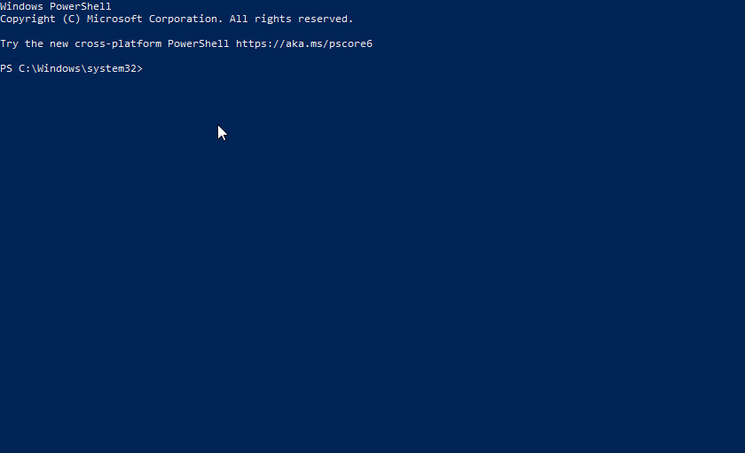
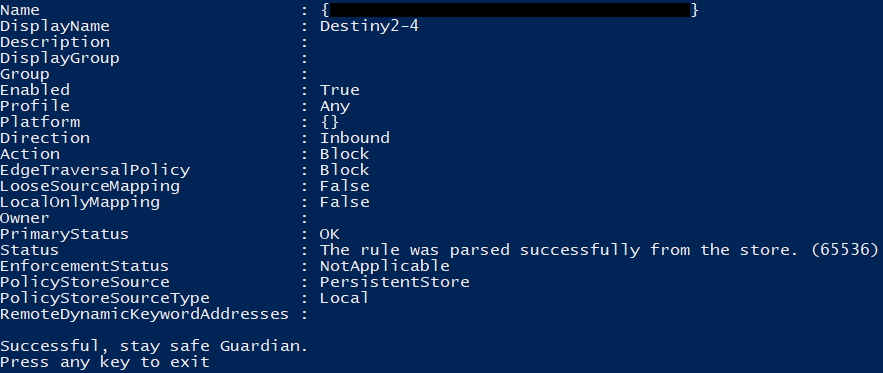

# Solo Lobby
In Destiny 2, a solo lobby is a game lobby type in which players are not matched up with other players and instead play the game and activities alone. This is often used for completing activities or missions that are normally played in a group, such as raids or strikes. Players in a solo lobby will not be able to see or interact with other players, and will be unable to access certain features that are only available in group play, such as matchmaking or voice chat. However, they will still be able to complete most activities and progress through the game as they would in a normal game session.

Solo lobbies can be created by loading into raids and dungeons with no other players in the fireteam; They can also be created by selecting higher difficulties on activties such nightfall strikes.

## Windows - Firewall Script
To create a solo lobby, you can create a custom ruleset on your Windows firewall to block ports used by Steam and Destiny to prevent matchmaking.

!!! warning "Proceed at Your Own Discretion"

	This script involves creating custom firewall rules to block port ranges utilized by Steam and games on Steam, such as Destiny 2 in this case; This script does not modify the game files of Destiny 2 by any means. With that being said, proceed at your own discretion.

Back in 2020, a member of the Destiny community, Pleasant-exe, created a script titled [Destiny 2 Solo](https://github.com/Pleasant-exe/Destiny-2-Solo-lobby) and made it available for anyone to download and use. For this guide, we recommend using the [PowerShell script (.ps1) file](https://github.com/Pleasant-exe/Destiny-2-Solo-lobby/blob/master/DestinySoloLobby.ps1) as you can self-audit the script that you are about to run on your system to see what it is actually doing when you go to run it.

### Downloading From GitHub

1. Open the [GitHub project repository (Pleasant-exe/Destiny-2-Solo-lobby)](https://github.com/Pleasant-exe/Destiny-2-Solo-lobby)
2. Select the `DestinySoloLobby.ps1` script from the repository file list to [view it](https://github.com/Pleasant-exe/Destiny-2-Solo-lobby/blob/master/DestinySoloLobby.ps1).
3. After you have reached the file view for the script, select the [Raw button](https://raw.githubusercontent.com/Pleasant-exe/Destiny-2-Solo-lobby/master/DestinySoloLobby.ps1) on the top right corner of the code preview section of the page.
4. While viewing the raw code of the script, right click on the page in your browser and select the `Save as...`/`Save page as...` option from the context menu to download the script.
5. You will want to save the page as a file with the name `DestinySoloLobby.ps1`; If the file name has `.txt` appended (shows as `ps1.txt`) to it, you will need to remove the .txt extension so that the page saves as a PowerShell script file instead of a text document.

### Setting Up & Running

#### PowerShell Execution Policy
After you have saved the script to your computer in an easily accessible location, you will need to set your [execution policy](https://learn.microsoft.com/en-us/powershell/module/microsoft.powershell.security/set-executionpolicy) to allow unsigned scripts to be executed by PowerShell. This can be achieved by running PowerShell as Administrator and running the following commands:

```ps
Set-ExecutionPolicy -ExecutionPolicy RemoteSigned
Set-ExecutionPolicy -Scope Process -ExecutionPolicy Bypass
```

You should then see a warning prompt get displayed with the following:

<center>
	
</center>

Once prompted type `A` for `Yes to All` and hit enter to submit.

After setting the execution policy for PowerShell, you are now ready to run the script.

#### Using The Script

Prior to running the script, the following items should be checked:

* You are logged into Steam; The script will prevent Steam from logging you into your account if you run it prior to launching and logging into Steam.
* Destiny 2 is not running; The script is somewhat safe to run while Destiny 2 is running while in orbit, however, you may experience game crashes or freezes.

To run the script, right click on the `DestinySoloLobby.ps1` script and select `Run with PowerShell` option from the context menu. You may receive a UAC prompt at this point asking to run PowerShell as Administrator; This privilege escalation is required as the script will be creating and managing firewall rules for your system upon execution.

Upon execution, the script will create and enable firewall rules with the name of Destiny2-#; You will see the payload in the PowerShell application window as the firewall rules are addressed. After the firewall has been configured, you will receive a notice that the script ran succesfully.

<center>
	
</center>

You can now launch Destiny 2 through Steam and begin any activities of your choice such as open world patrol to Vanguard Ops; It is not advised to launch any Crucible or Gambit matches as you will not be able to complete them due to the game requiring you to be matched with others.

After you have concluded your time playing solo on Destiny 2, shut down Destiny 2 and exit to desktop; After Destiny 2 has fully closed, simply run the script again using the above method and the script will remove the firewall rules from your system. After the script has cleaned up the firewall rules, you will simply get the `Successful, stay safe Guardian.` message.

## Xbox - Multiple Profiles

<center>
	<iframe width="750" height="422" src="https://www.youtube-nocookie.com/embed/SuFz6NrFCLw" title="YouTube video player" frameborder="0" allow="accelerometer; autoplay; clipboard-write; encrypted-media; gyroscope; picture-in-picture; web-share" allowfullscreen></iframe>
</center>

## Playstation - System Time

<iframe width="750" height="422" src="https://www.youtube-nocookie.com/embed/atJw7rxLFro" title="YouTube video player" frameborder="0" allow="accelerometer; autoplay; clipboard-write; encrypted-media; gyroscope; picture-in-picture; web-share" allowfullscreen></iframe>