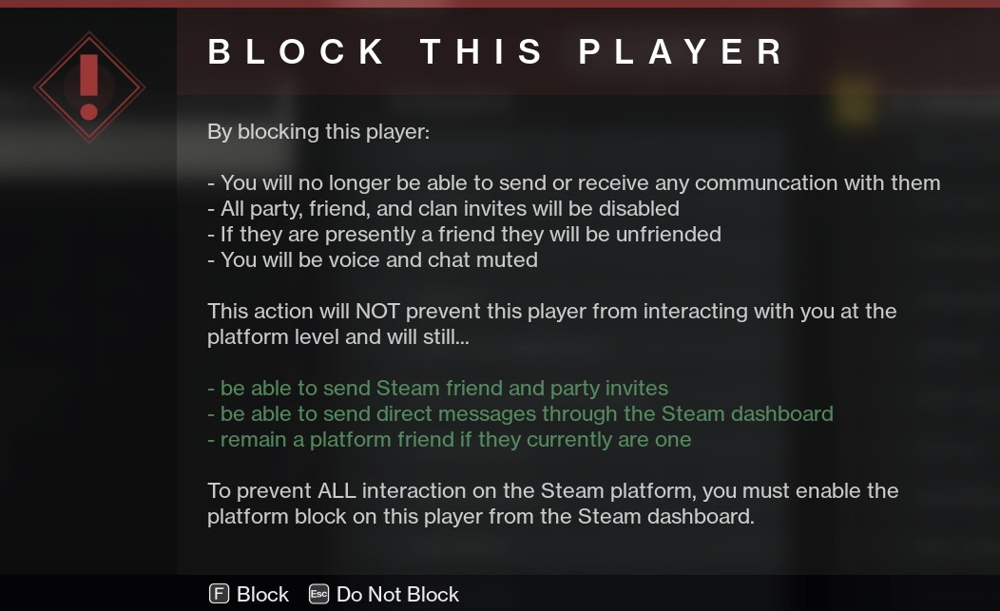

# Troublesome Players

## Blocking a Bungie Account

Sometimes you may encounter other players in-game that annoy you or you may not want to be bothered by someone while playing. If you come across a player that you'd wish to block from interacting with you, we encourage you to take steps for self-moderation as well as utilizing the in-game block feature.

If you wish to prevent all forms of in-game communication with another player in Destiny 2, within the roster you can select individual players and opt to `block` them. Blocking a player within Destiny 2 will only block them on the Bungie account level; This means that you will be unable to interact with the blocked player in any form within the game, but should you share the same platform with the player that you blocked, they will still be able to interact with you there.

If you wish to prevent them from interacting with you outside of Destiny 2, you will need to block their platform account as well, granted you're on the same platform as that blocked player. For example, if you and the individual that you wish to block both use Steam, if you want to block them completely you would need to block them in-game as well as on Steam.

Xeriscape's Destiny 2 clan is based on the PC/STEAM platform but utilizes cross-play. For individuals who play on the PC/STEAM platform the following is an example of the block prompt that they will see should they ever opt to block a player in Destiny 2:

	

