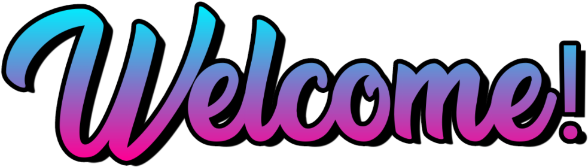

	 
	[Join our community Discord server for announcements and discussion!](https://discord.xeriscape.network/)

!!! tip "Work In Process"

    The Xeriscape Network is a work in process community and is in its infancy stage of being a community; Some sections of the community, such as the Discord server and this documentation website, may be incomplete in their feature set or have items that are temporary.

-   :fontawesome-solid-gamepad:{ .lg .middle } __Set up in 5 minutes__

    ---

    Install [`mkdocs-material`](#) with [`pip`](#) and get up
    and running in minutes

    [:octicons-arrow-right-24: Getting started](#)

-   :fontawesome-brands-discord:{ .lg .middle } __It's just Markdown__

    ---
    Focus on your content and generate a responsive and searchable static site

    [:octicons-arrow-right-24: Reference](#)

-   :fontawesome-solid-globe:{ .lg .middle } __Made to measure__

    ---

    Change the colors, fonts, language, icons, logo and more with a few lines

    [:octicons-arrow-right-24: Customization](#)

-   :material-pickaxe:{ .lg .middle } __Open Source, MIT__

    ---

    Material for MkDocs is licensed under MIT and available on [GitHub]

    [:octicons-arrow-right-24: License](#)

- [:fontawesome-solid-globe: Community Website](https://xeriscape.network/){ target="_blank" rel="noreferral" }
- [:simple-discord: Discord Server](https://discord.xeriscape.network/){ target="_blank" rel="noreferral" }
- [:simple-steam: Steam Community](https://steam.xeriscape.network/){ target="_blank" rel="noreferral" }
- [:simple-github: GitHub Organization](https://github.xeriscape.network/){ target="_blank" rel="noreferral" }

