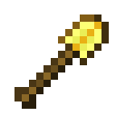
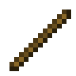
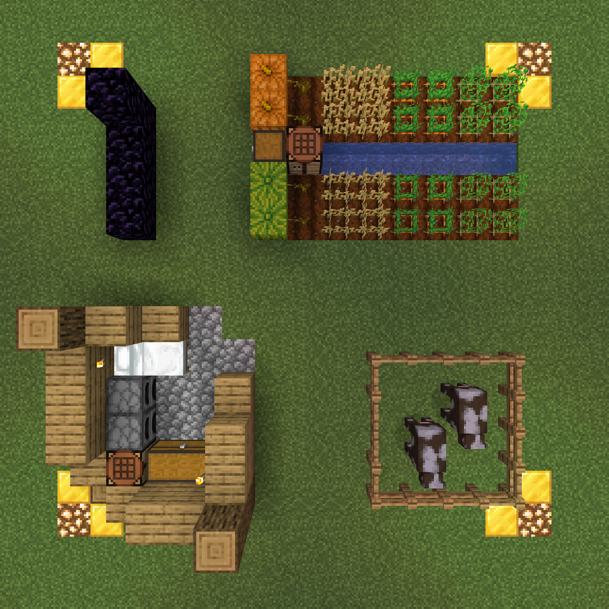
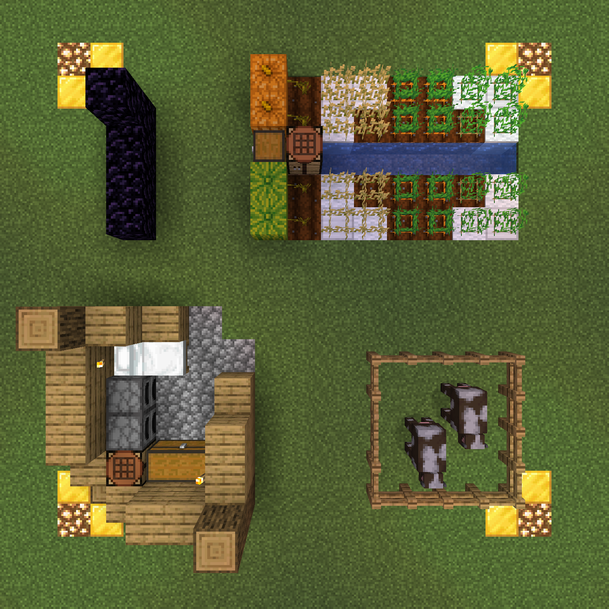

# Protection Claims

Claims are used as a means of protecting your builds from grief and looting by other players, as well as destruction by mobs such as creepers and endermen. Our system utilizes GriefDefender, so if you've used something similar, such as GriefPrevention, you should have no issue getting familiar with using our system, which gives you full control over your claimed land.

Every new player starts with 250 claim blocks, enough to protect an area approximately 15x15 blocks. Players will automatically accrue blocks as they play for the first few hours until they reach a maximum of 900 claim blocks, which is enough for a 30x30 area. You can check your available blocks in-game by equipping a Golden Shovel to enter claim mode.

## Video Tutorials
If you prefer a visual guide for the claiming process, check out these tutorials. While these videos focus on GriefPrevention, our system (GriefDefender) works in a similar manner, so there shouldn't be any issue following along:

- [Creating a Basic Claim](https://www.youtube.com/watch?v=VDsjXB-BaE0)
- [Creating Advanced Subdivisions](https://www.youtube.com/watch?v=I3FLCFam5LI)

## Claim Tools

The tools for interacting with the GriefDefender system are the Golden Shovel and the Stick.

### Creating & Resizing Claims
{ align=right}
The Golden Shovel is the tool you use to create new claims and adjust the size of existing ones.

1. Equip a Golden Shovel in your main hand.
2. Right-Click the ground at two opposite corners of an area that you wish to protect. You will see a Diamond Block marking the corners of your claim. 
    - Upon a successful claim creation, the corners will be clearly marked out with Gold Blocks and Glowstone.
    - Upon failure of creating a claim, the error message will be printed to chat. For example, if there is an overlap with an existing claim, the corners will change to Redstone Ore and Netherrack.

!!! info inline end "Claim Protection Height"

    In the Overworld, claims are full vertical height, from bedrock (Y=-64) to the build limit (Y=320). Claims created in the Nether are restricted to 3D volumetric claims, meaning they only protect the area between the two points you selected and are not full height.

Once a claim has been created, the region contained within is protected from modification. Other players cannot build, break blocks, or access your chests, furnaces, or interact with doors and other interactable blocks within the claim.

Start your claims off small with only what you truly need. You are allowed to claim large areas of land if you intend on using them, but if you claim a massive area (e.g., 300x300 blocks) and only use a small fraction of the space, your claim may be resized by staff without notice to ensure fair land distribution.

### Claim Inspection
{ align=right}
The Stick is your inspection tool for viewing protection details. While holding a stick in your main hand, you can perform the following actions:

- **Right-Click** any block with the Stick to check if it is part of a claim. If it is, the claim's boundaries will be highlighted (usually with glowstone/gold blocks) and information will be displayed in chat.
- **Shift + Right-Click** the ground with the Stick to view a list in chat of all nearby claims and their owners.

## Claim Management
You can manage your claimed land, set access permissions for friends, and control ownership using the following commands:

- `/kit claim` - Grants a kit containing a Golden Shovel and Stick
- `/claimtool` - Toggles claim functionality of the Golden Shovel and Stick
- `/abandonclaim` - Abandon the claim you are currently standing in
- `/abandonallclaims` - Abandon all of your claims; Requires confirmation
- `/trust <player>` - Grants full permissions (build, containers, access) to a player
- `/untrust <player>` - Revokes granted permissions from a player

## Player Trust Levels
Granting trust allows other players to interact with your claim, but the level of access depends entirely on the command you use. Remember, as the claim owner, you always maintain complete control over your claim and cannot be removed or have your claim taken over by anyone you trust.

| Trust Command             | Rights Granted                                   | Description                                                                                                                                                                                                                                  |
|---------------------------|--------------------------------------------------|----------------------------------------------------------------------------------------------------------------------------------------------------------------------------------------------------------------------------------------------|
| /trust <player>           | Full Access (Build, Break, Interact, Containers) | Gives the player the exact same rights as you within the claim. Only use this to players that you can truly trust.                                                                                                                           |
| /accesstrust <player>     | Basic Interactions                               | Allows the player to use doors, trapdoors, buttons, levers, beds, and other basic interactables, but they cannot build, break blocks, or access containers.                                                                                  |
| /containertrust <player>  | Container Access                                 | Allows the player to access chests, furnaces, barrels, dispensers, and other container-type blocks, but they cannot build or break blocks. Note: Blocks protected by the LWCX system will still be inaccessible as LWCX locks take priority. |
| /permissiontrust <player> | Trust Management                                 | Grants the player the ability to trust and untrust other players to your claim, at or below their own trust level.                                                                                                                           |

## Subdivisions
Subdivisions (also known as sub-claims) allow you to create smaller, nested claims inside a larger claim to manage permissions on a finer level. An example reason for a subdivision would be to create a public farm area within a private market claim. The corners of these subdivisions will be marked with White Wool and Iron Blocks when using a Stick for claim inspection.

1. Hold a Golden Shovel in your main hand
2. Run the `/subdivideclaims` to enter subdivision mode
3. Use the Golden Shovel (Right-Click) to define the boundaries of the subdivision within your claim, just as you would when creating a normal claim
4. You can then use the trust commands, such as those listed above, while standing in the subdivision to grant permissions only for that specific area

To exit subdivision mode, use the `/basicclaims` command.

## Obtaining More Claim Blocks
Claim blocks are a limited resource designed to limit the amount of land a player can protect, thereby ensuring they prioritize and claim only the areas they truly need for active use. For players who require additional claim blocks however, they can be acquired:

### Earning Blocks
Players start with 250 claim blocks upon first joining the server and will accrue additional blocks as they continue to play, up to a maximum of 900 blocks. This initial amount is enough for approximately a 15x15 claim, expanding up to a 30x30 claim once all blocks have been earned.

### Purchasing Blocks
If you need more than the maximum earned blocks, you can purchase additional blocks using our in-game virtual currency. Each claim block costs $10. Use the command: `/buyclaimblocks <amount>`. Additionally, if you have extra blocks, you can sell them back to the server for a refund, though the buyback price is heavily discounted.

## Expiration & Cleanup
Claims are automatically removed if a player remains inactive for a specific period. This system is in place to free up unused land for active players.

- **New Players:** Claims created by new players have an expiration of 14 days (two weeks).
- **Established Players:** Established players have a base level expiration of 60 days, with higher server ranks being granting even longer periods of inactivity before their claims expire.

To keep your claim active and reset the expiration countdown, simply log in to the server. Each login resets the expiration timer, regardless of your player rank. If a player does not log in prior to their claim expiring (e.g., a new player makes a claim but doesn't log in for 15 days), the claim's protection will be automatically removed. This means the land and any structures built within it remain, but they are no longer protected. The area and its contents become fair game for everyone else on the server, allowing other players to freely modify or take blocks from the formerly protected area.

## Claim Examples
Understanding the visual cues for claims and subdivisions is key to managing your land protections and respecting others' boundaries. The first example shows a basic claim, which is the default setup that most players will use for protection. The second example features a claim with a subdivision, which is a more advanced setup players have the option to utilize for granular permission control.

=== "Basic Claim"

    This example illustrates an example of a standard claim. The corners of the claim are highlighted with Gold Blocks and Glowstone, clearly marking the protected perimeter.

    Everything within this boundary is safe from other players and mob damage. This protection includes preventing non-trusted players from:

    - Breaking blocks, looting containers, or opening doors/gates.
    - Trampling crops (e.g., jumping on farmland)
    - Interacting with mobs (like the cows shown), including leashing, feeding, or attacking them

    

=== "Claim With Subdivision"

    This example shows a common use of a subdivision (or sub-claim), where a player creates a smaller claim within their larger main claim. In this case, the subdivision covers part of the farm and is marked by White Wool and Iron Block corners.

    The main claim is highlighted with Gold Blocks and Glowstone, while the subdivision uses White Wool and Iron Blocks, making it easy to distinguish the two boundaries at a glance.

    The claim owner, Steve, has used the `/trust` command while standing in this farm area to mark it as modifiable by Alex. This grants her the ability to harvest and replant the crops.

    The subdivision, however, does not extend to the melons and pumpkins, meaning that those crops remain fully protected by the main claim rules and cannot be harvested by Alex. The subdivision also intentionally excludes the farm chest, ensuring that the collected goods are only accessible to players trusted in the main claim.

    

[^1]:
	Additional commands and documentation can be found on the [official GriefPrevention wiki](https://docs.griefprevention.com/).
