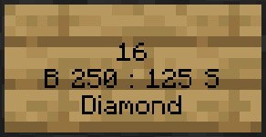
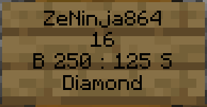

# Chest Shops
Chest Shops are the main method in setting up your own in-world, storefronts to buy or sell items to other players. They are considered the most reliable way to earn passive income from other players, allowing you to sell items in bulk while you are offline.

## What You Need
Before you can create a chest shop, you will need the following items:

- **A Chest:** This can be a single or double chest
- **An Item:** The item you wish to sell or buy from other players
- **A Sign:** Used to create your shop, listing prices and quantities
- **A Location:** A safe place, such as a claim, to create a shop at

## Creating The Chest Shop
Creating a chest shop involves placing a sign directly on the chest, or on a block immediately adjacent to the chest.

1. **Place the Chest:** Put down your chest(s) where you want your shop to be. 
2. **Place the Item:** Put at least one of the item you are trading inside the chest. This is how the shop system identifies the item type. 
3. **Place the Sign:** Place a sign on the chest or an adjacent block such as on the wall directly above the chest. 
4. **Fill the Sign:** In the sign editor, follow through with the proper format:
     - **Line 1:** Leave this blank. (It will autofill with your username). 
     - **Line 2:** Enter the Quantity to trade per click (e.g., 1 for a single item, or 64 for a stack). 
     - **Line 3:** Enter the Price in the format `B [Shop Buy Price] : S [Shop Sell Price]`.
          - Shops can also be created to only sell or buy items. To make a shop only sell items to players, you would set the price line to be `B [Shop Buy Price]`; To make a shop to where it only buys items from players, you would instead use `S [Shop Sell Price]`.
     - **Line 4:** Enter the namespaced ID without the `minecraft:` prefix (e.g., diamond_pickaxe) or see below if your item has custom metadata. 
5. **Hit 'Done':** After clicking done, the shop system will automatically format line one (your username) confirming that your shop has been successfully created.

For a visual example, here is a breakdown of a sign for a chest shop where Diamonds are sold and bought in quantities of sixteen. Players can buy sixteen diamonds from the shop for $250 and can sell to the owner of the shop for a payment of $125 for per sixteen diamonds sold.

It is strongly recommended using the `/lock` command on your shop's chest(s) to prevent other players from accessing or tampering with your stock and funds. If your chest is in a claim that is exclusively accessible and modifiable by you, this step is optional, but still highly recommended for an extra layer of protection.

### The Price Line
Line three of a chest shop's sign specifies the shop's function and prices:

| Format                | Example      | Function                                                                                                                                                                                                                         |
|-----------------------|--------------|----------------------------------------------------------------------------------------------------------------------------------------------------------------------------------------------------------------------------------|
| B <Price>             | B 100        | **This shop can only sell items to players.** You would pay the buy 'B' price to acquire the item(s) from the shop owner.                                                                                                        |
| S <Price>             | S 100        | **This shop can only buy items from players.** You would be paid the sell 'S' price from the shop owner in exchange for the item(s).                                                                                             |
| B <Price> : S <Price> | B 100 : S 25 | **This shop can sell items to players and buy items from players.** You would pay the buy 'B' price to acquire the item(s) from the shop owner while the shop owner will pay you the sell 'S' price in exchange for the item(s). |

### Advanced Item Handling (Items With Metadata)
For items that have metadata (custom names, lore, enchantments, etc.), you may need special handling to ensure your shop only trades that exact item.

#### The Quick Identifier
This method is used when you have a complex custom item and don't want to use `/iteminfo`.

To use this, you must place exactly one single item of the item you wish to trade inside the chest prior to creating the sign for the chest shop. The chest must not contain any other item types, as the system needs to identify the single, specific item for trade.

When creating the sign, on line four of the shop sign where you'd normally put the namespaced ID, you would instead simply put a `?` (question mark). The shop will automatically attempt to idenfity the specific item (including all custom metadata) from the item in the chest and use it to set up the shop. Once the shop sign has successfully been created, you are welcome to fully stock your shop's chest.

#### Using `/iteminfo`
If you prefer to have the exact text string for the item line of your chest shop sign, you can use the `/iteminfo` command instead.

1. Hold the item with the custom metadata in your main hand and run the `/iteminfo` command.
2. The command output will be printed to chat, and you will want to use the namespaced ID in the `Shop Sign` line for the fourth line on your chest shop sign.
