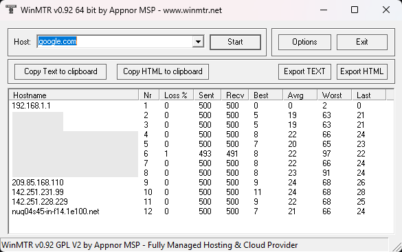

# Connection Issues

Experiencing frustrating lag, rubberbanding, or high ping on Telzenith? Connection issues can be tricky—they might be caused by your local internet, your ISP, or sometimes even the server itself.

To accurately pinpoint the source of the problem and get you back to smooth gameplay, we need a complete diagnostic picture. That’s where the MTR (My Traceroute) utility comes in.

MTR combines the functionality of two core network tools, `ping` and `traceroute`, into one powerful test that not only maps the path to the server but also measures data reliability over time.

## Recognizing Problems
If you notice frequent interruptions, block lag, or delays while playing on Telzenith, you are likely experiencing one or more of the following issues:

### High Latency
Latency, or ping, is the measure of the round trip time (in milliseconds, `ms`) for a small data packet to travel from your computer to the server and back.

The optimal ping for smooth gameplay is under `100ms`. If your latency is `300ms` or higher, it will severely hinder your gameplay, resulting in noticeable interruptions and major delays. You can always check your current ping in the player tablist or using the /ping command in-game.

It is important to note that if you are physically located far away from the server (e.g., on a different continent), high latency may be unavoidable, as data can only travel at the speed of light.

### Jitter (Ping Spikes)
Jitter is the fluctuation or variation of latency over a short period of time. It is often called ping spikes or stuttering. If your ping jumps from `50ms` to `500ms` and back repeatedly, that is high jitter.

A consistent connection with low jitter is crucial for seamless gameplay. High bandwidth usage on your network, or even local machine, like downloading large files or streaming, can significantly affect jitter, as addressed in the optimization tips below.

### Packet Loss
This occurs when data packets fail to reach their destination. It is measured as a percentage of lost packets relative to the total sent. The effect of packet loss is that the server may not receive your actions (e.g., blocks you broke reappear) or you may not receive server updates (e.g., resulting in invisible players or the world not loading).

Packet loss is often caused by network congestion or errors in wireless transmission.

## Optimizing Your Connection
Before running your MTR test or [submitting a ticket](../../community/feedback/support/), please ensure you have taken these basic steps to maximize your local connection quality. Eliminating these factors first ensures that your MTR report provides the cleanest and most accurate data.

- **Reconnect To The Server:** Often, a temporary routing issue or server-side hiccup can be resolved by simply disconnecting and immediately reconnecting to the server.
- **Avoid Bandwidth-Heavy Activities:** Pause or cancel any large file downloads, streaming (video/music), or cloud synchronization services (e.g., Dropbox, OneDrive) running on your computer and other devices in your household.
- **Disable VPNs:** While VPNs offer a layer of privacy, they often introduce an extra "hop" and unpredictable latency or jitter. For troubleshooting purposes covered in this article, please disable your VPN entirely to ensure you are testing your direct connection route.
- **Use a Wired Connection:** If possible, connect your computer directly to your router using an Ethernet cable instead of relying on Wi-Fi, which can suffer from interference and packet loss.

## Local & Router Checks
If the basic optimization tips didn't solve your issue, the problem might be your local hardware, software, or network configuration.

### Power Cycle Hardware
A power cycle is the most common fix for intermittent network issues. This clears the device's temporary memory (cache) and forces it to re-establish a fresh connection with your ISP.

1. Unplug your modem/router/gateway/etc. (the device connected to the ISP cable/fiber) and wait at least two full minutes. 
2. Plug the device back in and wait until it is fully online and has re-established a connection to your ISP. This is typically indicated by all lights being stable.
3. Test your connection to the server again by reconnecting.

### Software Interference
Sometimes, security software or device drivers can selectively block or interfere with gaming-specific traffic, even if general browsing works fine.

- **Firewall/Antivirus:** Ensure that your local computer firewall (Windows Defender, macOS Firewall) and any third-party antivirus program is explicitly allowing Minecraft (Java Edition) access to the internet. 
    - **While not generally advised for security reasons**, you can temporarily disable your system's firewall or antivirus for a brief moment to confirm if it is the source of the problem. It must be re-enabled immediately after testing to maintain device security. 
- **Update/Reinstall Network Drivers:** Outdated, incorrectly installed, or generally incorrect drivers for your Ethernet or Wi-Fi adapter can cause inefficiency and introduce lag. Check your computer manufacturer's website (Dell, HP, Apple, etc.) or the network card manufacturer (Intel, Realtek) for the latest driver updates.

## Router Settings
If your network is shared, and you still experience lag spikes when others are streaming or downloading, your router may be suffering from Bufferbloat (a term for excessive buffering causing high latency).

- **Quality of Service (QoS):** Not all home routers support this feature, but it is worth looking into. Look for a QoS setting in your router's administration interface (usually accessed by typing `192.168.1.1` or `192.168.0.1` into a web browser). If available, enable this feature and set your computer and/or the Minecraft game port to have high priority.[^1] This tells the router to send your game packets first, even when the network is busy.

!!! warning "Quality of Service Performance"

    Enabling Quality of Service (QoS) can sometimes cause erratic or worse performance if not configured perfectly for your specific hardware and usage patterns. Furthermore, some older or ISP-provided routers may not handle this feature well, leading to routing conflicts or strange behavior. If you notice strange or unstable performance after setting QoS, please try disabling it again.

## MTR Diagnostic Test
While you can easily run a standard single-snapshot `traceroute` (available as `tracert` on Windows and `traceroute` on macOS/Linux) from your system's command line emulator to see the path to the server, these tools only provide a single moment's snapshot of the connection. The MTR (My Traceroute) utility is the most effective tool because it continuously tests the connection over time, which is critical for diagnosing intermittent lag and packet loss. The abbreviation **MTR** stands for **M**y **T**race**r**oute because it merges the path-mapping capabilities of `traceroute` with the continuous statistical analysis of `ping`.

### Understanding an MTR
An MTR report provides a detailed view of the path your data takes to reach Telzenith, hop by hop:

- **Hops:** These are the individual routers your data packets travel through, starting with your home router and moving through your ISP's network and beyond.
- **Loss %:** The percentage of packets lost at that specific hop.
- **Avg/Best/Worst:** These columns display the latency metrics for that specific hop:
    - **Best** is the shortest time recorded, representing the fastest possible connection quality to that point. 
    - **Worst** is the longest time recorded, indicating any high latency spikes experienced.
    - **Avg** is the overall average latency, which is the most reliable indicator of typical performance at that hop.

By running an MTR test, we can see exactly where the connection is being affected, resulting in a slowdown or dropped packets.

The destination address that you will want to use for your test is `telzenith.xyz`

### Windows

1. Download and install WinMTR from its [SourceForge project page](https://sourceforge.net/projects/winmtr/files/Latest/WinMTR-v092.zip/download) and extract it to a place that you can easily access. Navigate to that location once the files have been extracted.
2. Launch the application and in the `Host` box, enter the server address of `telzenith.xyz`
3. Allow the test to run until the "Sent" packet count reaches 500 or more.
4. Click the `Export TEXT` button and save the `*.txt` file to a location you can easily access.
5. Upload the text file directly to your support ticket or send it to the staff member assisting you.

### MacOS
The `mtr` tool must be installed via a package manager like [Homebrew](https://brew.sh/).

1. Install Homebrew by opening your Terminal and enter the following command (you may be prompted to enter your password):
    ```
    /bin/bash -c "$(curl -fsSL https://raw.githubusercontent.com/Homebrew/install/HEAD/install.sh)"
    ```
2. Once Homebrew is installed, run the command: `brew install mtr`
3. Execute the MTR command, targeting the server: `mtr telzenith.xyz`
4. Allow the test to run until the "Sent" packet count reaches 500 or more.
5. Highlight the entire terminal output with your cursor, copy it with ++command+c++, and paste it into a blank TextEdit file. Save the file as a `*.txt` document.
6. Upload the text file directly to your support ticket or send it to the staff member assisting you.

### Linux
Open your terminal emulator and install MTR using the appropriate command for your distribution:

| Distribution       | Installation Command   |
|--------------------|------------------------|
| Debian/Ubuntu/Mint | `sudo apt install mtr` |
| Fedora/CentOS      | `sudo yum install mtr` |
| Arch/Manjaro       | `sudo pacman -S mtr`   |

1. Execute the command of `mtr telzenith.xyz` to start the MTR test
    - You can use `mtr -c 500 telzenith.xyz` to automatically stop after 500 packets if your version supports setting a manual packet count to send to the destination.
2. Allow the test to run until the "Sent" packet count reaches 500 or more.
3. Highlight the entire terminal output with your cursor, copy it with ++ctrl+c++, and paste it into a blank text editor file. Save the file as a `*.txt` document.
4. Upload the text file directly to your support ticket or send it to the staff member assisting you.


### Reading Your Results
When we receive your report, we look at where the "bottleneck" begins.

Below is an example of an MTR report run using WinMTR on Windows 11 with the host set to `google.com`. This simulation shows a typical, healthy connection with low latency and 1% packet loss starting mid-route at Hop 6. Please note that while the host is set to `google.com`, the final destination host often resolves to an address within the `1e100.net` domain, as [it is used for many of Google's own servers](https://support.google.com/faqs/answer/174717#:~:text=1e100.net%20is%20a%20Google%2Downed%20domain%20name%20used%20to%20identify%20the%20servers%20in%20our%20network.).

<figure markdown="span">
	
</figure>

#### Key Indicators

- **Issue is on your end (Local/ISP):** If you see high Loss% or high Avg/Worst latency appearing on Hops 1, 2, or 3 and these issues continue for all subsequent hops. This indicates a problem starting with your equipment or your local ISP network.
    - To confirm this is a general issue and not just Telzenith, test other services too such as trying to get in a voice chat on Discord, downloading a game through Steam to check your speed, or checking your speed on [fast.com](https://fast.com/). If these other services also show poor performance, or at least performance other than what you’re expecting to see, the issue is confirmed to be local or ISP-related. If confirmed, we highly recommend checking with your Internet Service Provider (ISP) for any known outages or maintenance issues in your area.
- **Issue is on a third-party transit provider:** If high Loss% or latency occurs at intermediate hops (e.g., Hop 6 in the example above) and continues through to the final destination, even on an [ASN](https://www.cloudflare.com/learning/network-layer/what-is-an-autonomous-system/) outside our control, we can escalate the issue to our hosting provider. They can use their carrier peering relationships to work with the third-party network and help reroute or resolve the issue.
- **Issue is on the server end:** If all hops show good Loss% (0.0%) and reasonable latency until the final few hops, where there is a sudden and significant increase in latency or loss that does not appear earlier in the route. While this is rare, the MTR will confirm it.

When reaching out for support, providing this report is the most valuable thing you can do to help us troubleshoot your connection, so running it accurately is a huge help!

## Name Resolution

!!! warning inline end "Geographic Location"

    Switching to a public DNS provider is usually safe, but in rare cases, it can increase lookup times if the server is geographically distant or if your ISP's local DNS has better routing. If you notice a general slowdown in web browsing or game connection after changing, revert to your ISP's default configuration settings.

While Domain Name System (DNS) servers do not directly affect your in-game latency (ping or jitter), they are responsible for translating the server address (telzenith.xyz) into a usable IP address that your computer can connect to.

If you occasionally see "Unknown Host" errors, or if you feel your connection process is slow, switching from your ISP's default DNS server to a public, optimized DNS server can help speed up lookups and improve reliability.

Two popular recommended public DNS providers are [Google's Public DNS](https://developers.google.com/speed/public-dns/docs/using) and [CloudFlare's 1.1.1.1](https://developers.cloudflare.com/1.1.1.1/#:~:text=Linux,Windows).[^2]

[^1]: Enabling or modifying configuration settings on your network hardware is performed at your own risk. Because support for specific settings varies by device, incorrect configuration may result in temporary loss of connectivity or degraded service performance until the original settings are restored.

[^2]: Changing DNS settings, whether on your router or individual devices, is also done at your own risk. Unsupported or incorrect DNS configurations can cause loss of connectivity, slow browsing, or issues reaching certain websites until the original settings are restored.