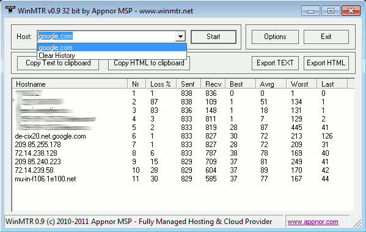

# MTR Diagnostic Test

Connection issues that you may encounter while playing on Aetherlands can be caused by a large range of issues. It could be related to your internet connection or something on the server itself. This method allows us to help diagnose your internet connection to the server in order to help provide further assistance on fixing your issue. MTR combines the ping and traceroute tools of your operating system into one powerful utility that has the ability to not only measure the availability of devices and the numbers of hops to reach the destination but also the ability to measure packet loss and jitter as well.

!!! warning "High Latency"

	Actively playing on Aetherlands with a ping of 300ms or higher will present noticeable interruptions while on the server. You can check your current ping at any time in the player tablist as well as through the `/ping` command.

## Background Information
* **What is ping?**  
Ping is a measure of the round trip from your computer to the destination server when a request is made. Ping is measured in milliseconds (ms) and the lower the number, the lower your data transfer delays will be.
* **What is jitter?**  
Jitter is the rate at which ping changes over a period of time (sometimes called ping spikes or stuttering). Jittering is essentially the fluctuation or variation of latency over time. Simply put, if every information packet takes the same amount of time to travel from point A to point B, then there is no jitter. However, if the packet delivery times are inconsistent, then there is jitter. Similar to ping rates, the lower the jitter value for the connection, the better.
* **What is a traceroute?**  
A traceroute is a network diagnostic tool used to track in real-time the pathway taken by a packet on a network from its source to the defined destination, reporting the IP addresses of all the routers it pinged in between; These are typically referred to as hops. Traceroute also records the time between each hop the packet makes during its route to the destination.
* **What is packet loss?**  
Packet loss occurs when one or more packets of data traveling across a computer network fail to reach their destination. Packet loss is either caused by errors in data transmission, typically across wireless networks, or network congestion. Packet loss is measured as a percentage of packets lost with respect to packets sent.

## MTR for Windows
1. Download WinMTR from it's [SourceForge project page](https://sourceforge.net/projects/winmtr/files/WinMTR-v092.zip/download) and install it on your computer.
2. Run the application and enter the IP address you wish to test into the host box at the top. In this case, we want to use play.aetherlands.xyz.
3. Let the MTR run until you see the number of sent packets reach a minimum of at least 100.
4. Click Export TEXT and save the *.txt file to a directory that you can easily access it from.
5. Upload the text file to your ticket or send it directly to the staff member who is assisting you.

## MTR for MacOS
1. Install HomeBrew on your Mac. Open Terminal and enter the command: ``/bin/bash -c “$(curl -fsSL https://raw.githubusercontent.com/Homebrew/install/master/install.sh)”``. Your Mac may ask you for your username and password as an added security measure.
2. Once HomeBrew has been installed, run the command `brew install mtr` in the terminal window that you still have open from the previous step.
3. After the package mtr has been installed on your Mac, you will be able to run `mtr <IP address>` from the terminal; Run the command of `mtr play.aetherlands.xyz`.
4. Let the MTR run until you see the number of sent packets reach a minimum of at least 100.
5. Highlight and select the terminal windows with your cursor, copy it to your clipboard with `COMMAND + C`, and paste it into a blank TextEdit file. Once the report has been pasted into the file, save it as a *.txt file to a directory that you can easily access it from.
6. Upload the text file to your ticket or send it directly to the staff member who is assisting you.

## MTR for Linux
1. Open terminal; Depending on your Linux distribution, you will need to use one of the following commands:
	* Debian/-based (Ubuntu, Mint, KDE Neon, Pop!_OS): `sudo apt install mtr`
	* Fedora: `sudo yum install mtr`
	* Arch/Arch-based (Manjaro): `sudo pacman -S mtr`
	* Distro not listed: Research MTR installation instructions for your distrobution.
2. Run the command of `mtr -g play.aetherlands.xyz` to start an MTR test.
3. Let the MTR run until you see the number of sent packets reach a minimum of at least 100.
4. Highlight and select the terminal windows with your cursor, copy it to your clipboard with CTRL + C, and paste it into a blank text editor file. Once the report has been pasted into the file, save it as a *.txt file to a directory that you can easily access it from.
5. Upload the text file to your ticket or send it directly to the staff member who is assisting you.

## How We Use Your MTR Results
MTR reports provide us with crucial information on whether the connection issue is from the player’s side or the server’s side. As an example, here is an MTR report that was conducted using WinMTR:

	

When we receive a report, we take a look at specific columns to determine how much of your information is reaching the server and vice versa. The first column is what we refer to as hops; This is the number of routers, within and outside of your home network, that your packets have encountered and been routed through in order to reach the destination of Aetherlands. With this and the other information, such as the number of sent and received packets, we are able to determine the issue and can provide further assistance from there.
