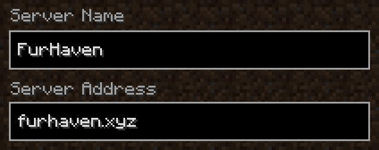
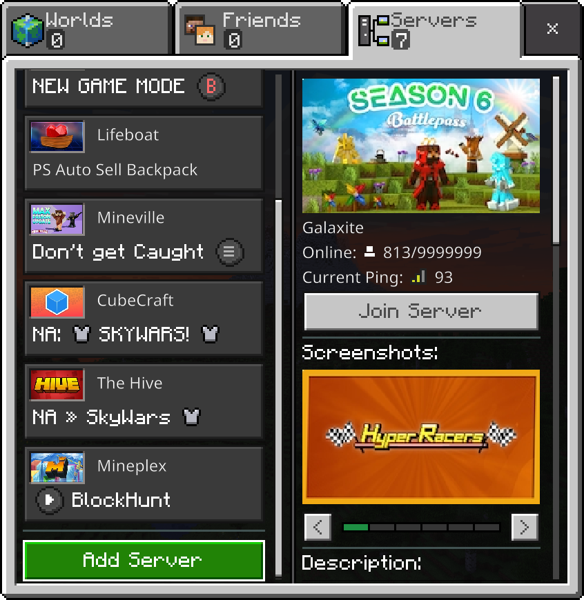
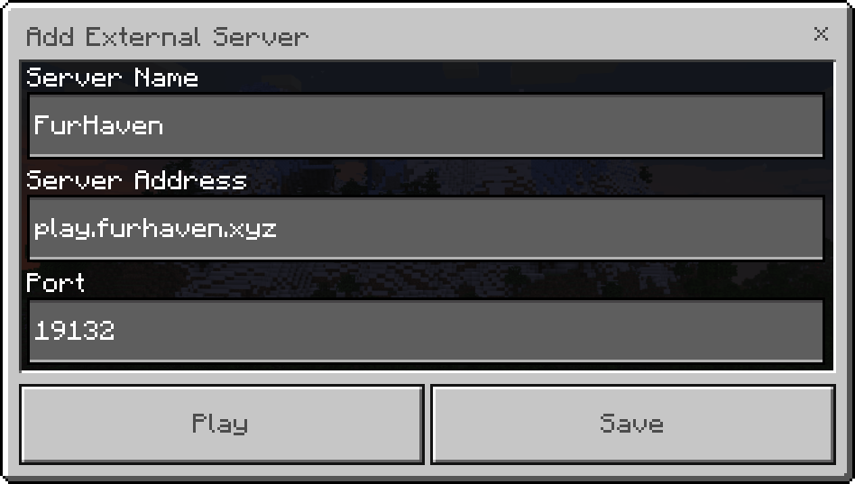
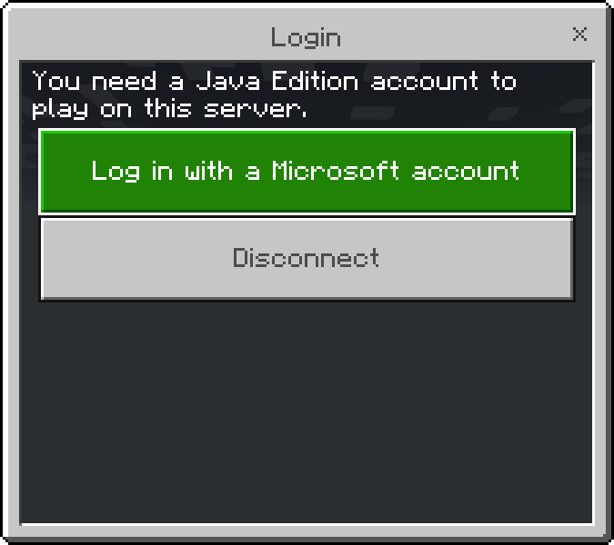
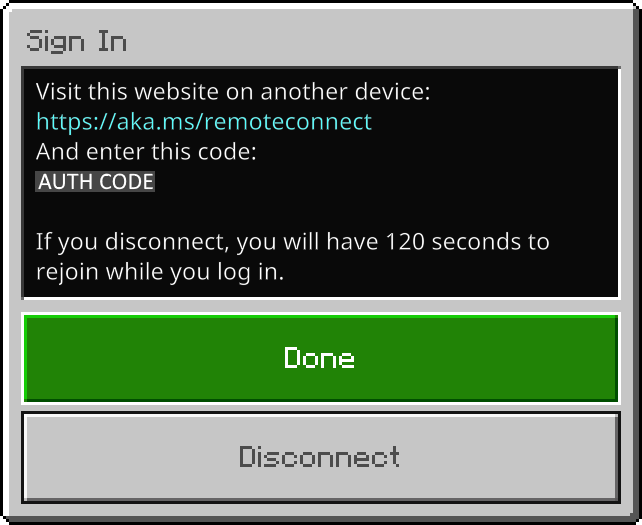
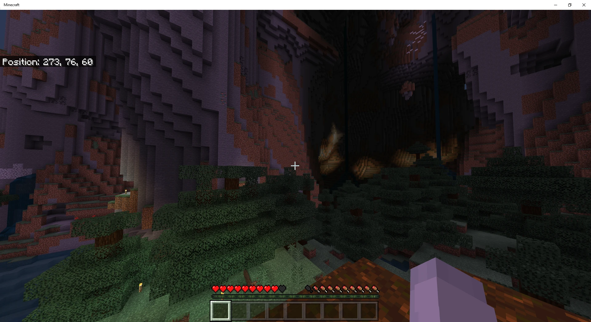

# Connecting to the Server

Aurelium Realms is a private whitelisted Minecraft server, as mentioned in the overview page; Individuals who wish to join the server must be active members of the Xeriscape community in order to be added to the whitelist. Anyone who wishes to join the server and is not a member of Xeriscape, must join the community before being granted server access.

Aurelium Realms is a server that is runs on Minecraft Java Edition’s codebase, and any members of the community who wish to play on Aurelium must use Java Edition; Clients are based on Minecraft Bedrock Edition (Bedrock codebase – e.g. Windows 10 Edition, Pocket Edition) may connect to the server through a translation proxy (see below); This is not the officially endorsed method of accessing the server as there may be graphical glitches and parity issues.

## Connecting to the Server
Members of the community who wish to join Aurelium should use the latest stable version of Minecraft and connect through either domain of `aetherlands.xyz` or `telzenith.xyz`. Clients that are running a newer version of Minecraft can connect to the server through the use of a protocol hack that is enabled on the server[^1]; As previously mentioned, Bedrock clients (Windows 10 and Pocket Edition) can also connect to the server.[^2]

[^1]:
	Using a Minecraft client version newer than the server will result in your client being limited to the features that are present in the version that the server is running. There may also be visual glitches with blocks that support connected models, such as fences, where they appear separate or improperly placed in the world.

[^2]:
	Connecting to the server network through a Minecraft Bedrock Edition client is an alternate means of playing on the server. Such support is not guaranteed and visual glitches as well as the complete feature set of the server may not be available to players connecting to the server through a Bedrock Edition client.

### Java Edition
Java edition is the recommended method of connecting to Aurelium as that is the same codebase that the server network was built upon; To connect to Aurelium, simply open your `Multiplayer` server list and select the `Add Server` button at the bottom of the Multiplayer menu. Set the `Server Name` to `Aethereal Highlands` and the `Server Address` to `aetherlands.xyz`. After entering the appropriate server information, select the `Done` button; You should now be able to connect to the server that is now listed in your multiplayer menu server list.

	

### Bedrock Edition
As mentioned, clients running Minecraft's Bedrock Edition codebase can also connect to the server through our GeyserMC proxy. The instructions below cover the process of adding the server and connecting to it on Minecraft Pocket and Windows editions; If you would like to connect to Aurelium on a console instead, please refer to [this GeyserMC wiki article](https://wiki.geysermc.org/geyser/using-geyser-with-consoles/) for walkthroughs on connecting to the server on PlayStation, XBox, and/or Nintendo Switch. 

??? warning "Minecraft Bedrock Edition Client Parity"

	Minecraft Bedrock Edition client support is provided as a convenience to our players and **is not** the officially supported method of connecting to the server as not all server features may be accessible.
	
	Some [parity issues](https://github.com/GeyserMC/Geyser/issues), such as combat and graphical issues are also to be expected to be present while using a bedrock client to connect to and play on the server.
	
	These are items that Xeriscape cannot fix and will only be addressed by the Geyser team [if reported](https://github.com/GeyserMC/Geyser/issues) as they are present as a consequence of using Bedrock client on a Java based server.

To connect through Bedrock, navigate to the `Servers` tab of the play menu and scroll down to the bottom past the partner multiplayer servers to where you have the option to add a server. Select the `Add Server` button to add Aurelium as one of your multiplayer servers.

	

In the `Add External Server` prompt, set the `Server Name` to `Aethereal Highlands` and use the `play.aetherlands.xyz` domain for the `Server Address`. The port field should remain untouched as we utilize Bedrock's default port of `19132` for incoming Bedrock client connections. Once you have entered relevant server information, select the `Save` button to return to your multiplayer servers menu. Minecraft should display the newly added server at the bottom of your server list below the partnered servers with the server displaying its information. You can then select the server and chose to connect from there.

	

Upon connecting to the server, you will be met with a login gateway for a Microsoft account; Connecting to Aethereal Highlands requires an account with a valid copy Java Edition[^3] regardless of if a player is using Java Edition or Bedrock Edition. To continue with the connection to the server, select the `Log in with a Microsoft account` option from the `Login` popup.

[^3]:
	Connecting to the server using a Minecraft client version newer than the server will result in your client being limited to the features that are present in the version that the server is running. There may also be visual glitches with blocks that support connected models, such as fences, where they appear separate or improperly placed in the world.

	

This selection will bring you to the authorization popup in which you will need to navigate to [https://aka.ms/remoteconnect/](https://aka.ms/remoteconnect/) in your web browser and enter the authorization code. Upon entering the code you will need to login with your Microsoft account and authorize the GeyserMC application. **The code will expire after two minutes (120 seconds). You will need to reconnect if your code expires.**

After you have successfully authorized the GeyserMC application, you can return to Minecraft and select the `Done` button on the authorization popup to confirm your login to the server.

	

You should be placed into the server where you last logged out at and you should be able to able to play on the server just as you if you were on any other server. Some gameplay differences between Java and Bedrock will become apparent as you play on the server, such as with the combat system as to where you'll need to time your attacks rather than resort to spamming them.

	

## Failover Domains
In the event that players are unable to connect to Aurelium MC through the `xeriscape.network`, `aetherlands.xyz`, and `telzenith.xyz` domains, it is recommended that they try the failover domain of `telzenith.network` before beginning to troubleshoot their connection.

In the event of a player being unable to connect to the server after attempting connection through the failover domain, they should refer to the [Connection Diagnostic Test article](../troubleshooting/mtr-diagnostic.md).
