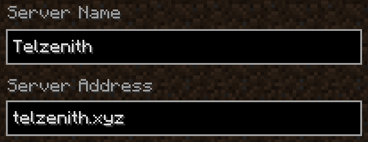
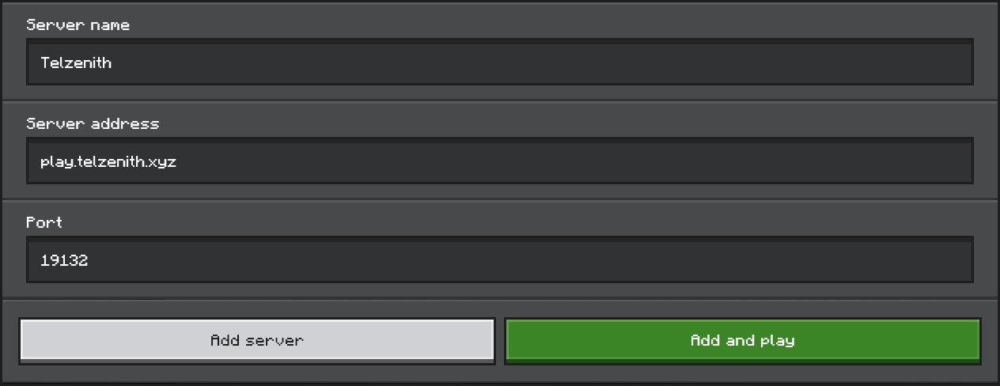

# Joining the Server
Telzenith is a public Minecraft Java Edition server, open to all players. To join, simply connect using a Java Edition Minecraft client.

While Telzenith primarily runs on Java Edition, players using Bedrock Edition clients (e.g., Windows 10 Edition, Pocket Edition) may connect through a translation proxy. However, please be aware that this is not the officially supported method, and you may experience graphical glitches or parity issues. We recommend using a Java Edition client for the best experience.

## Connecting to the Server
Players wishing to join Telzenith should use the latest stable version of Minecraft Java Edition and connect via `telzenith.xyz`. Players using newer Minecraft Java Edition versions can connect through the server's enabled protocol hack[^1]. As previously mentioned, Bedrock Edition players can also connect via a translation proxy[^2].

[^1]:
	Using a Minecraft client version newer than the server will result in your client being limited to the features that are present in the version that the server is running. There may also be visual glitches with blocks that support connected models, such as fences, where they appear separate or improperly placed in the world.

[^2]:
	Connecting to the server network through a Minecraft Bedrock Edition client is an alternate means of playing on the server. Such support is not guaranteed and visual glitches as well as the complete feature set of the server may not be available to players connecting to the server through a Bedrock Edition client.

### Java Edition
Java Edition is the officially supported connection method for Telzenith, as it aligns with the server's codebase.

To connect, open your Minecraft Java Edition `Multiplayer` server list and select `Add Server`. Set the `Server Name` to `Telzenith` and the `Server Address` to `telzenith.xyz`. 

Select `Done` to add the server; You should then be able to connect to the server.

	

### Bedrock Edition
As mentioned, clients running Minecraft's Bedrock Edition codebase can also connect to the server through our GeyserMC proxy. The instructions below cover the process of adding the server and connecting to it on Minecraft Pocket and Windows editions; If you would like to connect to Telzenith on a console instead, please refer to [this GeyserMC wiki article](https://geysermc.org/wiki/geyser/using-geyser-with-consoles/) for information regarding how to connect to a server on console. 

??? warning "Minecraft Bedrock Edition Client Parity"

	Minecraft Bedrock Edition client support is provided as a convenience to our players and **is not** the officially supported method of connecting to the server as not all server features may be accessible.
	
	Some [parity issues](https://geysermc.org/wiki/geyser/current-limitations/), such as combat and graphical issues are also to be expected to be present while using a bedrock client to connect to and play on the server.
	
	These are items that Xeriscape cannot fix and will only be addressed by the Geyser team [if reported](https://github.com/GeyserMC/Geyser/issues) as they are present as a consequence of using Bedrock client on a Java based server.

To connect through Bedrock, navigate to the `Servers` tab of the play menu and select the `+ Add Server` button to add Telzenith as one of your external multiplayer servers.

In the `Add A New Server` prompt, set the `Server Name` to `Telzenith` and use `telzenith.xyz` for the `Server Address`. The port field should remain untouched as we utilize Bedrock's default port of `19132` for incoming Bedrock client connections. Once you have entered relevant server information, you can pick either option to add the server to your list. Regardless of your choice, Minecraft should display the newly added server at the bottom of your server list below the partnered servers with the server displaying its information. You can then select the server and chose to connect from there.

	

!!! info inline end "Minecraft ID Linking"

    If you own Minecraft Java Edition and would prefer to use that identity while playing on the server through Geyser, you may link your account using Geyser’s Microsoft OAuth system at [link.geysermc.org](https://link.geysermc.org/).

    Once linked, the server will prioritize your Java Edition presence over your Bedrock one. If you need help migrating your data after linking your Java UUID and Xbox XUID, please reach out to a staff member for assistance.

When connecting to the server, you will enter the world just like any other player, with no gameplay differences—especially for those familiar with Java Edition. The only visible difference is how your username is formatted: any spaces in your name will be replaced with underscores (`_`), and your name will be prefixed with a `.` to prevent conflicts with existing Java usernames.

[^3]:
	Connecting to the server using a Minecraft client version newer than the server will result in your client being limited to the features that are present in the version that the server is running. There may also be visual glitches with blocks that support connected models, such as fences, where they appear separate or improperly placed in the world.

## Fail-Over Domains
If players are unable to connect to Telzenith via `telzenith.xyz`, they should also try the fail-over domain `telzenith.network` and the community domain `xeriscape.network`.

If connection issues persist after attempting the fail-over domain, refer to the [Connection Diagnostic Test article](../troubleshooting/connection.md).
